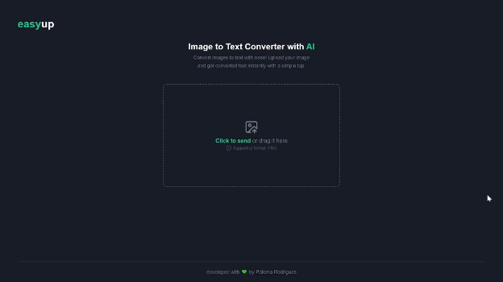

# easyup - frontend

easyup is a tool that allows you to upload images and use artificial intelligence to convert them into text.

## 🔨 Features

- [x] Upload image
- [x] Transcribe image with ai

## 🧪 Tools

- [React](https://react.dev/)
- [TypeScript](https://www.typescriptlang.org/)
- [Vite](https://vitejs.dev/)
- [TailwindCSS](https://tailwindcss.com/)
- [lucide-react](https://lucide.dev/)
- [react-markdown](https://www.npmjs.com/package/react-markdown)
- [react-dropzone](https://www.npmjs.com/package/react-dropzone)
- [axios](https://axios-http.com/)

## 🚀 Deploy

You can access the project through [this link](https://ai-easyup-frontend.vercel.app/)

---

Developed with 💜 by <a href="https://www.linkedin.com/in/palomarodrigs" target="_blank">Paloma Rodrigues</a>

